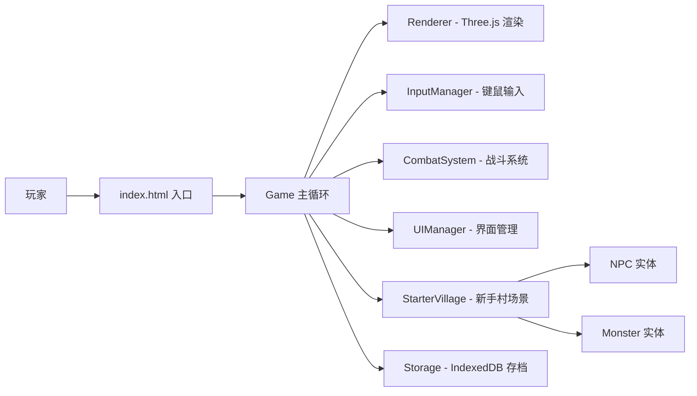

# 寻道人 - H5开放世界3D修仙游戏

> 从凡人到大罗金仙的修仙之旅 — 基于 Three.js 构建的纯前端 H5 开放世界 3D RPG 游戏

## 🛠 技术栈

- Frontend: HTML + CSS + JavaScript (原生，零框架)
- 3D Engine: Three.js（本地化部署，从国内源下载）
- Storage: IndexedDB（本地持久化存储）
- Build: 无需构建，直接运行
- Backend: 无
- Database: 无

## 🏗️ 系统架构



**核心数据流：**

1. 玩家通过 WASD 移动圆柱角色，鼠标点击选中目标（NPC/怪物）
2. 战斗系统处理技能释放、伤害计算、经验分配、掉落结算
3. 境界系统根据等级自动突破，10 级转职
4. IndexedDB 自动存档（60 秒间隔）+ 手动存档，刷新不丢失

## 🚀 快速启动

使用 Docker + Nginx 启动（自动禁用浏览器缓存）：

```bash
# 方式一：docker-compose 一键启动
docker-compose up -d

# 方式二：手动构建运行
cd frontend
docker build -t xundaoren-h5-rpg .
docker run -d -p 3050:80 xundaoren-h5-rpg
```

访问：http://localhost:3050

> 无需安装任何依赖，无需构建步骤。Three.js 已下载到本地 `js/lib/` 目录。

### 生成测试存档

进入游戏后按 `F8` 键，自动生成一个 81 级满级测试存档（大罗金仙境界）。可在主菜单「读取存档」中加载。

## 📊 核心功能

1. **MMO 操作体验** — 参考魔兽世界的经典键鼠操作，WASD 移动、Tab 切换目标、1-7 技能快捷键
2. **81 级境界系统** — 从凡人（0 级）到大罗金仙（81 级），共 11 个大境界，每个境界提供属性加成
3. **3 大职业** — 锻体（近战坦克）、练气（远程法师）、通灵（控制辅助），10 级转职
4. **即时战斗系统** — 技能冷却 CD、伤害数字飘字、Buff 增益、怪物 AI 状态机（巡逻/追击/攻击/返回）
5. **新手村完整场景** — 4 个功能 NPC（村长、铁匠、技能师、守卫）+ 3 种新手怪物
6. **NPC 对话树** — 条件分支对话，根据等级/职业/任务状态显示不同选项
7. **存档系统** — IndexedDB 持久化，自动存档 + 手动存档，支持多存档管理
8. **完整 UI 体系** — HUD 状态栏、目标框、技能栏、背包、角色面板、商店、转职选择面板

## 🎮 操作说明

| 操作 | 按键/鼠标 |
| ---- | --------- |
| 移动 | W / A / S / D |
| 选中目标 | 鼠标左键点击 |
| 切换目标 | Tab |
| 与 NPC 交互 | 鼠标右键 / E |
| 使用技能 | 1 - 7 |
| 跳跃 | 空格 |
| 打开背包 | B |
| 打开技能面板 | K |
| 角色面板 | C |
| 游戏菜单 | ESC |
| [调试] 生成满级存档 | F8 |

## ⚔️ 职业体系

| 职业 | 定位 | 主属性 |
| ---- | ---- | ------ |
| 💪 锻体 | 近战坦克 | 防御/生命 |
| 🌀 练气 | 远程法师 | 攻击/法力 |
| 👻 通灵 | 控制辅助 | 法力/速度 |

## 🏔️ 境界系统（81 级制）

| 等级范围 | 境界名称 | 属性加成 | 解锁内容 |
| -------- | -------- | -------- | -------- |
| 0 | 凡人 | 基础 | 基础技能学习 |
| 1-9 | 炼气期 | +10% | — |
| 10-18 | 筑基期 | +25% | **10 级转职** |
| 19-27 | 金丹期 | +45% | — |
| 28-36 | 元婴期 | +70% | — |
| 37-45 | 化神期 | +100% | — |
| 46-54 | 炼虚期 | +140% | — |
| 55-63 | 合体期 | +190% | — |
| 64-72 | 大乘期 | +250% | — |
| 73-80 | 渡劫期 | +320% | — |
| 81 | 大罗金仙 | +400% | 终极境界 |

## 📁 项目结构

```
├── index.html                  # 游戏入口（主菜单/角色创建/游戏 UI 全部内联）
├── css/
│   └── main.css                # 全局样式、UI 组件样式、动画
├── js/
│   ├── main.js                 # Game 主类，游戏循环，模块整合入口
│   ├── lib/
│   │   └── three.min.js        # Three.js 库（本地化，国内源下载）
│   ├── core/
│   │   ├── Renderer.js         # Three.js 场景/相机/渲染器封装
│   │   ├── InputManager.js     # 键盘 + 鼠标输入管理
│   │   └── Storage.js          # IndexedDB 存档与设置持久化
│   ├── entities/
│   │   ├── Player.js           # 玩家实体（圆柱模型，属性，背包，技能）
│   │   ├── NPC.js              # NPC 实体（对话，交互判定）
│   │   └── Monster.js          # 怪物实体（立方体模型，AI 状态机）
│   ├── systems/
│   │   ├── Combat.js           # 战斗系统（伤害计算，技能释放，经验结算）
│   │   └── EffectsManager.js   # 视觉特效管理（伤害飘字，技能特效）
│   ├── world/
│   │   └── StarterVillage.js   # 新手村场景（地形，NPC 放置，怪物刷新）
│   ├── data/
│   │   ├── realms.js           # 81 级境界定义与属性加成
│   │   ├── classes.js          # 3 职业配置（锻体/练气/通灵）
│   │   ├── skills.js           # 基础技能 + 职业技能定义
│   │   ├── monsters.js         # 怪物属性与掉落配置
│   │   ├── npcs.js             # NPC 配置与对话树
│   │   └── items.js            # 物品定义（消耗品/材料/装备）
│   └── ui/
│       └── UIManager.js        # 全部 UI 管理（HUD/面板/对话/商店/转职）
├── assets/                     # 静态资源目录
└── docs/
    └── plans/
        └── 2026-02-06-xundaoren-design.md  # 游戏设计文档
```

## 🗺️ 新手村地图

```
        ┌──────────────────────────────────────┐
        │              围墙边界                 │
        │  ┌─────────┐                         │
        │  │ 练功区  │                         │
        │  │(低级怪) │                         │
        │  └─────────┘                         │
        │                                      │
        │         ┌─────────────┐              │
        │         │   中央广场   │              │
        │  (王大锤)│  (村长云老)  │(青衣)       │
        │         │  (守卫李猛)  │              │
        │         └─────────────┘              │
        │                                      │
        │  ┌─────────┐          ┌─────────┐   │
        │  │ 铁匠铺  │          │ 修炼台  │   │
        │  └─────────┘          └─────────┘   │
        │                 ▲                    │
        │            [出生点]                  │
        └──────────────────────────────────────┘
```

**NPC 一览：**

| NPC 名称 | 颜色（圆柱） | 功能职责 |
| -------- | ------------ | -------- |
| 村长·云老 | 白色 + 光环 | 主线引导、10 级转职 |
| 铁匠·王大锤 | 橙色 | 装备系统（预留扩展） |
| 修炼指导·青衣 | 蓝色 | 技能学习（擒龙功）、境界突破 |
| 守卫·李猛 | 红色 | 战斗教学 |

**新手怪物：**

| 怪物名称 | 等级 | 生命 | 攻击 | 经验 | 掉落 |
| -------- | ---- | ---- | ---- | ---- | ---- |
| 野兔妖 | 1 | 30 | 5 | 10 | 兔毛 |
| 木精 | 2 | 50 | 8 | 18 | 木精核 |
| 石傀儡 | 3 | 80 | 12 | 30 | 石块 |

## 🔧 技术实现

**3D 渲染** — 圆柱体代表角色/NPC，立方体代表怪物，Three.js 实时渲染，第三人称跟随相机

**战斗公式** — `最终伤害 = (攻击力 × 技能倍率) - (目标防御 × 0.5)`，保底伤害 1

**怪物 AI** — 五态状态机：idle → patrol → chase → attack → return，基于距离触发仇恨

**经验衰减** — 等级差 >5 级经验 -50%，>10 级经验 -90%，升级公式：`当前等级 × 100 + 50`

**数据持久化** — IndexedDB 数据库 `XunDaoRenDB`，saves 表存完整角色数据，settings 表存游戏设置

## 📷 游戏画面

- 主菜单：开始新游戏 / 读取存档 / 游戏设置
- 角色创建：输入道号，踏上修仙之路
- 游戏内：3D 新手村场景，顶部 HUD + 底部技能栏 + 战斗日志
- 转职面板：10 级后选择锻体/练气/通灵三大职业
- 战斗：点击怪物选中，技能快捷键释放，伤害数字飘字

## ⚙️ 浏览器兼容

支持所有现代浏览器（需支持 ES Module + IndexedDB + WebGL）：
- Chrome 80+
- Firefox 78+
- Safari 14+
- Edge 80+

> 推荐使用本地 HTTP 服务器运行，直接打开 `index.html` 可能因 ES Module 跨域策略受限。
